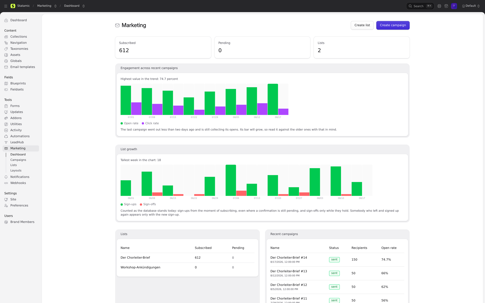
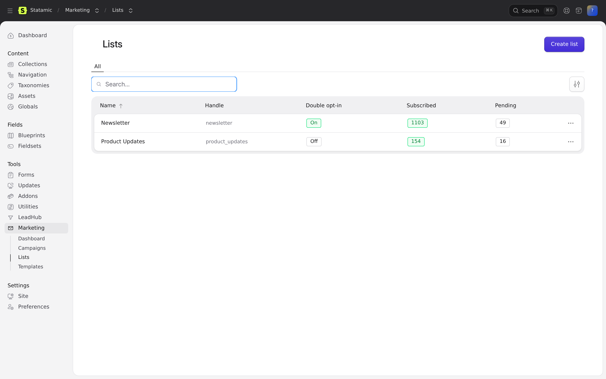
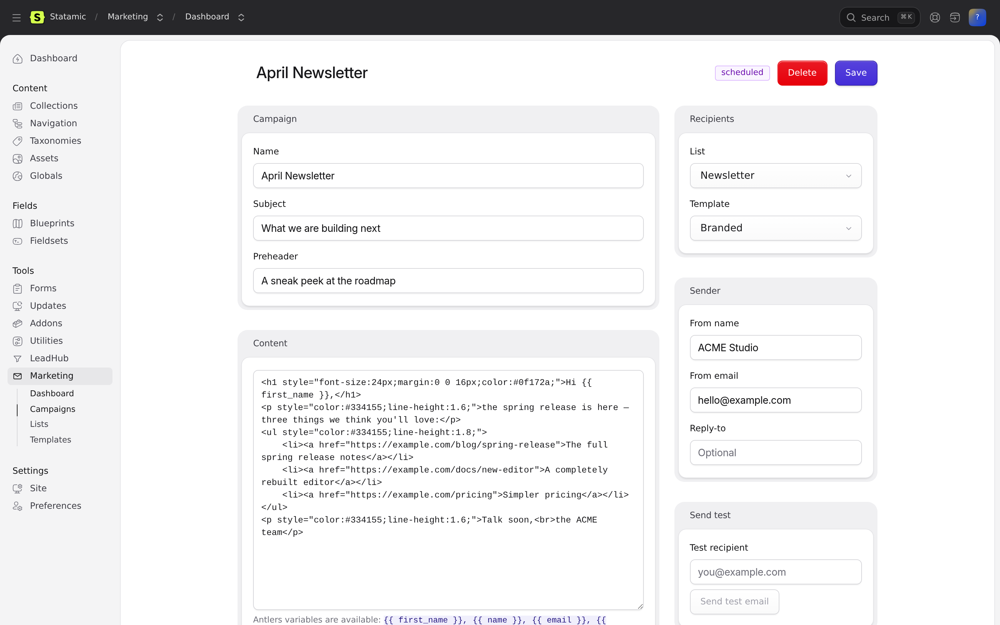
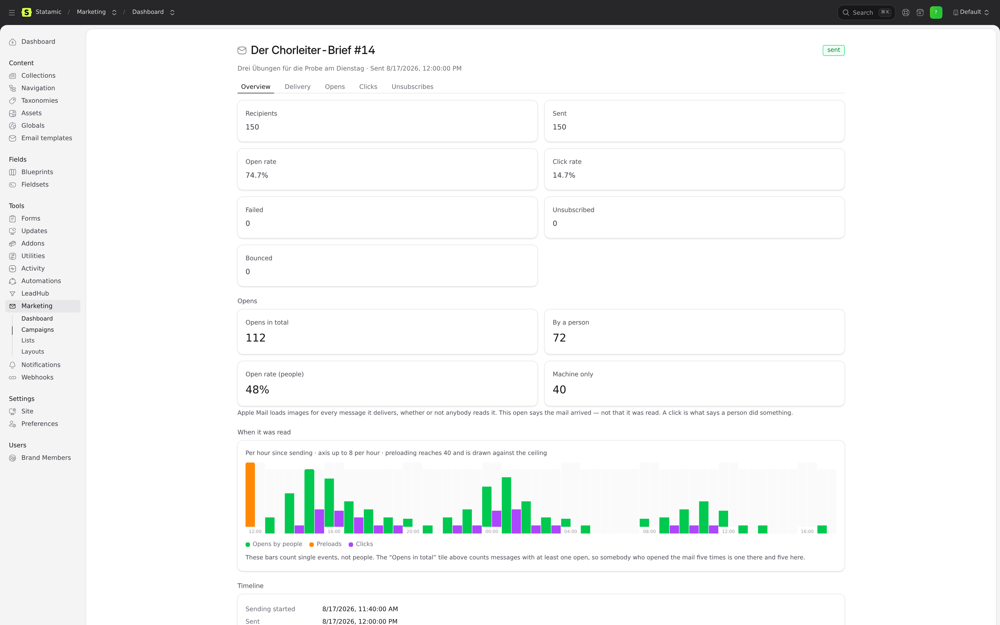

# Statamic Marketing

Email marketing and newsletters directly inside your Statamic 6 Control Panel —
mailing lists, double opt-in, campaigns, batch sending, and open/click tracking.
Think Mailcoach, but native to Statamic and built on top of
[LeadHub](https://github.com/goldnead/statamic-leadhub) contacts.

## The addon family

| Addon | Role |
| --- | --- |
| [statamic-leadhub](https://github.com/goldnead/statamic-leadhub) | CRM: contacts, tags, timeline — **required**, subscribers are LeadHub contacts |
| [statamic-brand-context](https://github.com/goldnead/statamic-brand-context) | **Required** as a package. Multi-brand *mode* is off by default; the package is not optional |
| [statamic-suppression](https://github.com/goldnead/statamic-suppression) | **Required**. The gate every send path asks before it delivers |
| [statamic-preference-center](https://github.com/goldnead/statamic-preference-center) | Optional: one preference page over marketing lists, notification types and suppression. Installing it moves every footer link there automatically |
| [statamic-webhook-manager](https://github.com/goldnead/statamic-webhook-manager) | Optional: ESP feedback webhooks in (bounces/complaints), marketing events out |
| [statamic-automations](https://github.com/goldnead/statamic-automations) | Optional: marketing triggers & actions for visual drip workflows |
| **statamic-marketing** | Lists, opt-in, campaigns, sending, tracking |

## Features

- **Mailing lists** with per-list double opt-in (confirmation mail + tokenized
  confirm link) and honeypot-guarded public subscribe endpoint.
- **Campaigns** composed in Antlers (`{{ first_name }}`, `{{ name }}`,
  `{{ email }}`, `{{ unsubscribe_url }}`, …), wrapped in reusable **email
  templates**, with preview, test send, scheduling, and send-now.
- **Segment targeting**: optionally narrow a campaign's audience to a **LeadHub
  segment** (with a live member count in the CP). The audience is `subscribed
  list members ∩ segment members`, resolved at send time — the segment only
  narrows; consent always comes from the list. No segment = the whole list.
  Requires LeadHub ^1.1; degrades gracefully (whole-list send) on older LeadHub.
- **Queued batch sending** through any Laravel mailer with configurable
  throttle, per-recipient message records, and automatic finalization.
- **Tracking**: open pixel, signed click redirects, per-campaign reports
  (open/click rates, bounces, unsubscribes).
- **Unsubscribes** via tokenized link plus RFC 8058 one-click
  (`List-Unsubscribe` / `List-Unsubscribe-Post` headers), optional global
  opt-out to LeadHub's `do_not_contact`.
- **Unsubscribe, always**: a tokenized link ends one list and says so, with no
  login and no optional package involved. Where
  [statamic-preference-center](https://github.com/goldnead/statamic-preference-center)
  is installed, every footer link goes there instead — one page for all of this
  brand's lists, notification types and the suppression state. Marketing does
  not ship a second copy of that page; the switch is a single resolver
  (`src/Support/PreferenceLink.php`), so nothing has to be reconfigured when the
  addon appears or goes away. The RFC 8058 one-click endpoint stays on marketing
  either way.
- **LeadHub native**: subscribing upserts the contact, records timeline events
  (`marketing.subscribed` / `marketing.unsubscribed`), and tags contacts with
  `list:{handle}`. Hard bounces and complaints opt the contact out.
- **Flat-file first**: lists, campaigns, and templates live as YAML under
  `content/marketing/` (version-controllable, the Statamic way) — or in the
  database via `MARKETING_DRIVER=eloquent`. Runtime data (subscriptions,
  messages, events) is always Eloquent.
- **Sibling integrations** (auto-detected, both optional):
  - *Webhook Manager*: marketing events become outbound webhook triggers; the
    `marketing.process_esp_event` inbound action maps Mailgun/Postmark bounce
    webhooks onto subscriptions.
  - *Automations*: triggers (`marketing.subscribed`, `marketing.unsubscribed`,
    `marketing.campaign_sent`) and actions (`marketing.subscribe`,
    `marketing.unsubscribe`, `marketing.send_campaign`) in the visual builder.

## Screenshots

| | |
| --- | --- |
|  |  |
| Audience and recent campaign performance at a glance | Lists with double-opt-in status and live subscriber counts |
|  |  |
| Antlers content, sender, scheduling, test send | Delivery, open and click rates, per-recipient log |

## Requirements

| | |
| --- | --- |
| PHP | 8.2+ (8.3+ when running Laravel 13) |
| Laravel | 12 or 13 |
| Statamic | 6 |
| Required addons | `goldnead/statamic-leadhub`, `goldnead/statamic-brand-context`, `goldnead/statamic-suppression` |
| Optional addons | `goldnead/statamic-preference-center`, `goldnead/statamic-webhook-manager`, `goldnead/statamic-automations` |
| Also needed | a queue worker (campaign delivery) and the Laravel scheduler (scheduled campaigns) |

All three required addons are installed for you by Composer. `brand-context` is
required as a *package* even on a single-brand site — only its multi-brand mode
is optional.

## Installation

> **Not yet installable from Packagist.** The three required sibling addons are
> private repositories, and Composer only reads the `repositories` block of the
> *root* project — never of a package it is installing. So the plain
> `composer require goldnead/statamic-marketing` cannot resolve them and will
> fail. Until the siblings are published, add the repositories to your own
> `composer.json` first:

```jsonc
// your project's composer.json
"repositories": [
    { "type": "vcs", "url": "https://github.com/goldnead/statamic-brand-context.git" },
    { "type": "vcs", "url": "https://github.com/goldnead/statamic-leadhub.git" },
    { "type": "vcs", "url": "https://github.com/goldnead/statamic-suppression.git" }
]
```

```bash
composer require goldnead/statamic-marketing
php artisan migrate
```

Publish the config if you want to tweak defaults:

```bash
php artisan vendor:publish --tag=marketing-config
```

Make sure a queue worker is running for campaign delivery, and the Laravel
scheduler for scheduled campaigns (`marketing:send-scheduled` runs every
minute).

## Frontend signup form

```antlers
{{ marketing:subscribe list="newsletter" class="newsletter-form" }}
    <input type="email" name="email" required placeholder="you@example.com">
    <input type="text" name="first_name" placeholder="First name">
    <button>Subscribe</button>
{{ /marketing:subscribe }}
```

Or POST to `{{ marketing:subscribe_url }}` yourself (`email`, `list`, optional
`first_name`, `last_name`, `_redirect`). JSON clients receive
`{ "ok": true, "data": { "status": "pending|subscribed" } }`.

## Multi-brand

Optional, off by default. With `goldnead/statamic-brand-context` in multi-brand
mode both storage drivers isolate lists, campaigns and templates per brand —
the eloquent driver by `brand_id`, the flat driver by directory:

```
content/marketing/
  acme/lists/newsletter.yaml
  contoso/lists/updates.yaml
```

**Single-brand installs need to do nothing.** They keep the plain
`content/marketing/lists/…` layout, and files still in it are read as the
default brand's even after multi-brand is switched on. Once a second brand
exists, move them into the default brand's directory:

```bash
php artisan marketing:migrate-flat-brands --dry-run   # show the moves
php artisan marketing:migrate-flat-brands             # do them
```

It only ever moves; it never overwrites, never deletes, and a second run is a
no-op. `--brand=` picks a different target brand.

### Checking the consent guarantee

One address on one list is one consent record, and the database is what
enforces it. `php artisan migrate` reporting success says the migrations ran;
it does not say the constraints they were supposed to leave behind are there.
This asks the second question directly:

```bash
php artisan marketing:consent-integrity            # report only, changes nothing
php artisan marketing:consent-integrity --repair   # rebuild the index, if nothing is in the way
```

It reads the indexes on `marketing_subscriptions` as they are right now and the
rows in it, names any list/address pair holding more than one subscription with
each row's id, status and confirmation date, and exits non-zero if the
guarantee is not in force. It never deletes a subscription: which of two
sign-ups is *the* consent record is a decision about people, and `--repair`
refuses to build the index while anything would have to go for it.

Worth running once after any update that touched migrations, and in particular
on an install that came from 1.2.1 or earlier through 1.6.1–1.6.3 — see the
1.6.4 entry in `CHANGELOG.md`.

**List handles are unique across all brands** in both drivers. The public
subscribe endpoint derives the brand from the list handle the form names — no
brand in the URL, no session, nothing for a visitor to get wrong — and that
only holds while a handle has exactly one owner. Creating a duplicate is
refused with a message naming the brand that holds it.

## Configuration highlights (`config/marketing.php`)

| Key | Default | Purpose |
| --- | --- | --- |
| `storage.driver` | `flat` | `flat` (YAML in `content/marketing/`) or `eloquent` |
| `sending.mailer` | app default | Laravel mailer for campaigns |
| `sending.messages_per_minute` | `0` | Throttle for ESP rate limits (0 = off) |
| `subscriptions.double_opt_in` | `true` | Default for new lists (per-list override) |
| `unsubscribe.global_opt_out` | `false` | Also set LeadHub `do_not_contact` on unsubscribe |
| `tracking.opens` / `tracking.clicks` | `true` | Toggle tracking |
| `leadhub.tag_subscribers` | `true` | Tag contacts with `list:{handle}` |

## Testing

```bash
composer install
vendor/bin/pest                     # flat driver (default)
MARKETING_DRIVER=eloquent vendor/bin/pest   # eloquent driver

# Live cross-addon integration suite (installs automations + webhook-manager
# into a throwaway copy; point the *_PATH vars at local checkouts):
AUTOMATIONS_PATH=../statamic-automations \
WEBHOOK_MANAGER_PATH=../statamic-webhook-manager \
scripts/test-siblings.sh
```

CI note: `goldnead/statamic-leadhub` is a private sibling repo, so the GitHub
Actions workflows need a `SIBLING_REPOS_TOKEN` repository secret (a PAT with
read access to it) to check it out next to this package.

### Against a real MySQL server

```bash
vendor/bin/pest -c phpunit.mysql.xml
MARKETING_DRIVER=eloquent vendor/bin/pest -c phpunit.mysql.xml
```

Same tests, `DB_DRIVER=mysql`; point `DB_HOST` / `DB_PORT` / `DB_DATABASE` /
`DB_USERNAME` / `DB_PASSWORD` at a throwaway database, which the suite migrates
from scratch on every test.

SQLite is not a substitute for it. It has no InnoDB key-length limit, stores no
fixed column widths and has no per-character byte cost, so a green SQLite run
says nothing about whether MySQL can build this schema at all — the blind spot
that took `statamic-notifications` down on production. `tests/Unit/IndexKeyLengthTest.php`
covers that class of defect without needing a server: it compiles the addon's
own migration files through Laravel's MySQL grammar in pretend mode and measures
every index the way InnoDB would, including whether a unique covers a column
that may be NULL and therefore constrains nothing.

### Component tests (Vitest)

```bash
npm install
npm test               # or: npx vitest run   /   npx vitest  (watch)
```

The Control Panel is a Vue SPA, and until 1.6.1 nothing in this package could
execute a line of it. PHPUnit reaches the controller and the props it hands
over; `tests/Feature/CpValidationVisibilityTest.php` reads the .vue sources and
proves the error wiring is present. Neither can say whether a rejected form
actually shows the message — that sat between them, and a screenshot was the
only evidence there was.

Vitest closes that gap. It is deliberately narrow:

- **What belongs here:** logic inside a component — computed fallbacks, which
  operator a stored `false` or `0` has to survive, where an error is rendered,
  what a component is handed.
- **What does not:** navigation, saving, permissions end to end, anything
  crossing into PHP. Those are feature tests.

Setup notes, in case something fails at an import rather than at an assertion:

- Vitest reads the same `vite.config.js`. Under `VITEST` the Statamic Vite
  plugin is swapped for the plain Vue plugin, because the former rewrites
  `vue` to `window.Vue` — correct for the CP bundle, fatal in a test process.
- `@statamic/cms/ui` and `@statamic/cms/inertia` are re-export shims that
  destructure a `__STATAMIC__` global the CP installs at runtime.
  `tests/js/setup.js` installs it first and answers every requested name with
  a stub component that mirrors its attributes into the DOM, so a test can
  assert what a component was handed without pinning down CP markup that is
  not ours. It also installs `__` as a real global, because a `<script setup>`
  block calls the translator directly and Vue Test Utils' `mocks` only reach
  templates.

## License

MIT
